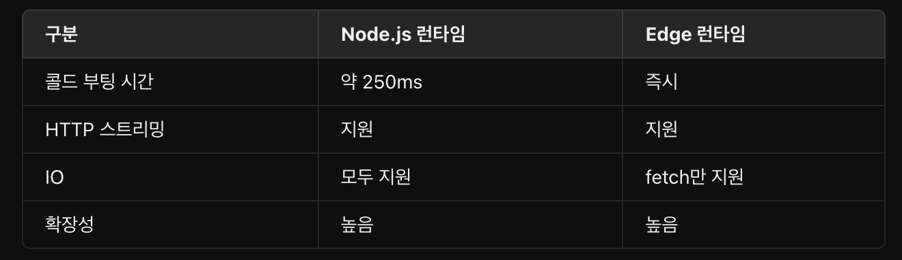

## 런타임(runtime)

- 프로그램의 실행이 시작되어 종료될 때까지의 시간 동안 `프로그램이 동작하는 모든 단계와 상황`.
- 컴파일 단계에서 생성된 `기계어나 중간 코드가 실제로 실행되는 시간`.

- 과거 컴퓨터 시스템이 `명령을 처리하는 과정이 짧아서` 런타임 개념이 강조되지 않음.
- 점차 프로그래밍 언어가 복잡, 프로그램이 더 다양한 작업 => 프로그램 실행 도중의 동작과 문제 해결의 중요도가 증가!
  - `런타임`이라는 개념이 더 강조됨!

## 런타임 환경

- 프로그램이 실행되는 동안
  - 필요한 `모든 요소와 리소스를 포함한 환경`.
  - 해당 프로그램이 사용하는 라이브러리, 모듈, 실행 파일, 설정 파일, 시스템 자원 등 필요로 하는 모든 것이 포함된다!

## 런타임 환경의 역할

1. 메모리 관리

   - 프로그램이 사용하는 메모리를 관리하고 할당/해제하는 역할
   - 프로그램이 메모리를 효율적으로 사용할 수 있도록 도와준다.

2. 변수와 데이터 관리

   - 런타임은
     - 변수의 스코프를 관리
     - 데이터 타입 체크
     - 메머리 내에서 데이터를 저장하고 조작하는 역할
     - etc

3. 예외 처리

   - 런타임은
     - 프로그램 실행 중에 발생하는 예외나 오류를 처리
     - 프로그램이 충돌하지 않도록 안정성 제공

4. 동시성 관리

   - 런타임은
     - 멀티스레딩과 같은 병렬 실행을 관리
     - 스래드나 프로세스 간의 동기화를 제어

5. 입출력 관리

   - 파일, 네트워크, 입출력 장치 등과의 상호작용을 관리하고 제어.

6. 라이브러리 지원

   - 프로그램이 라이브러리를 호출하고 사용할 수 있도록 환경을 제공.

7. 가상화와 추상화
   - 하드웨어 추상화와 가상화를 통해 프로그램이 특정 하드웨어나 운영체제에 종속되지 않도록 해준다.

## 정리

- 런타임은 프로그램이 실행되는 동안의 시간을 가리키며 런타임 환경은 프로그램이 실행되는 동안 필요한 모든 요소와 리소스를 포함한 환경을 의미합니다.
- 컴퓨터 프로그래밍에서 언어별로 해당 언어의 런타임이 제공하는 기능이나 동작 방식이 다릅니다. 이에 따라 프로그램의 동작이나 성능도 영향을 받을 수 있는데 프로그래밍 언어에 따라 런타임 환경이 강조되는 경우도 있습니다.

## 주요한 자바스크립트 런타임 환경

- 웹 브라우저

  - 웹 페이지의 자바스크립트를 실행
  - 구글 V8, 애플 javaScriptCore
  - 돔에 접근하여 웹 페이지의 구조와 컨텐츠를 조작
  - 브라우저 이벤트 처리, AJAX 요청, 웹 API 호출

- Node
  - 서버측 자바스크립트 런타임 환경으로써 브라우저 외부에서 자바스크립트 코드를 실행할 수 있게 해준다.
  - 구글에서 개발한 오픈 소스 자바스크립트 엔진 V8을 기반으로 동작.
  - Node를 설치하면 함께 설치되는 npm을 패키지 관리자로 이용

# Next.js의 런타임(환경)

- 실행 중에 코드에서 사용할 수 있는 라이브러리, API 및 일반적인 기능 집합.
- Next.js에는 애플리케이션 코드의 일부를 랜더링할 수 있는 두 가지 서버 런타임이 있다!

1. Node.js 런타임
   - JavaScript 언어를 사용하여 서버 측 애플리케이션을 개발할 수 있는 환경.
   - 비동기 처리, 이벤트 기반 프로그래밍 지원.
   - 파일 시스템 접근, 데이터베이스 연결 등의 작업 수행.
2. Edge 런타임
   - 클라이언트 측에서 실행되는 런타임.
   - 빠른 속도와 적은 리소스 사용량이 특징!
   - 클라이언트와 가까운 위치에서 실행되어 응답 속도가 빠르다,
   - 세션, 쿠기 확인, 리다이렉트 등의 작업 수행.

=> Next.js에서는 런타임을 선택하여 애플리케이션의 성능과 기능을 최적화할 수 있다.

app 디렉토리는 `기본적으로 Node.js 런타임`을 사용하지만, `라우트별로 다른 런타임으로 선택`할 수 있습니다.
Segment Runtime Option

https://velog.io/@chacha_fe/Rendering-Edge-and-Node.js-Runtimes
https://nextjs.org/docs/app/building-your-application/rendering/edge-and-nodejs-runtimes
